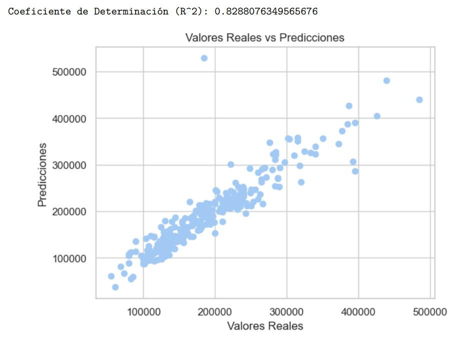
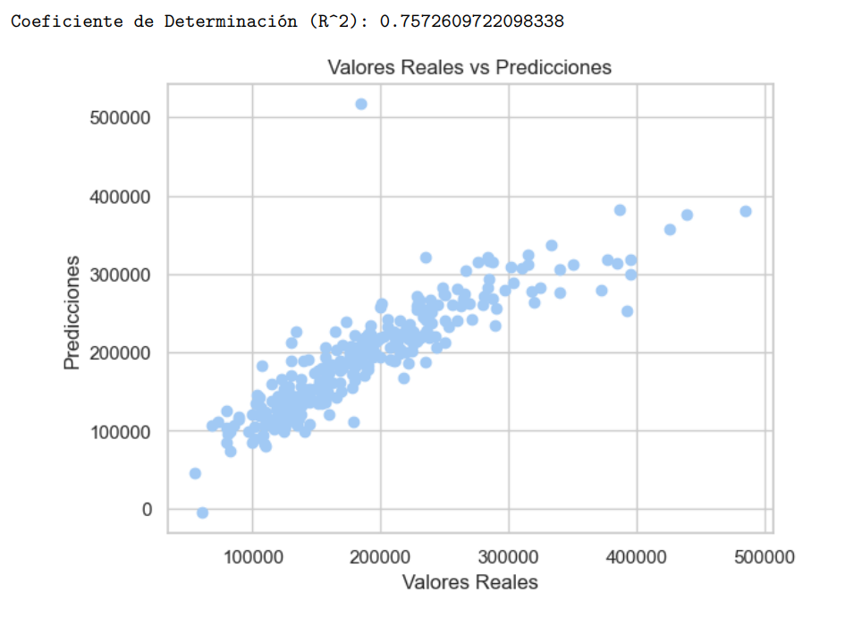
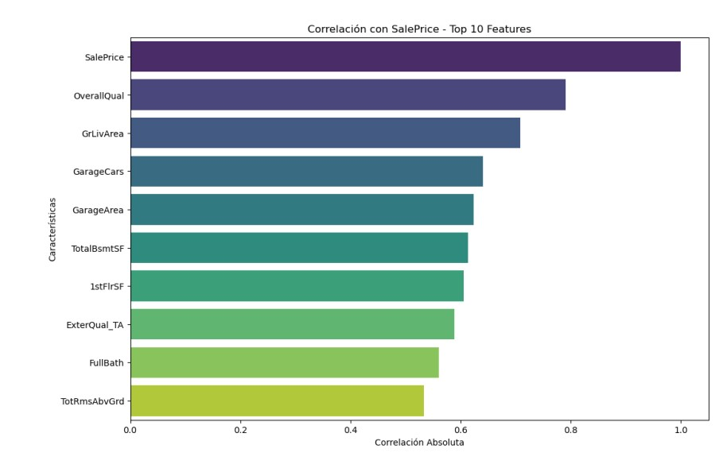

# INDEX 📋

* **ModeloRegresionLinealVivienda**  
  + [**About project**](#about-project) ⭐
  + [**Screenshots**](#screenshots) 📷
  + [**Technologies**](#technologies) 💻
  + [**Setup**](#setup) 🔧
  + [**Status**](#status) ⚪
  + [**Contact**](#contact) 📞

# About project⭐

**Date**: February, 2024.   
**Duration**: 2 days.

This project was developed in order to learn **Lineal Regresion Model**; 

# Preview🔍

[💠You can try it!💠](https://github.com/Hukex/ModeloRegresionLinealVivienda/blob/main/ModeloViviendaPrecioFEVM.ipynb?raw=true)

# Screenshots📷

> 
> 
> 

# Technologies💻

* **Python**
* **Jupyter Notebook**
* **Conda(Not strictly necessary)**

# Setup🔧

If you want to try the model just install Python and VSCode(Jupyter extension) and the necesary python packages that are in import.

``` bash
git clone https://github.com/Hukex/ModeloRegresionLinealVivienda.git
```

# Status⚪

**Finished.**

It was for practice in class

# Contact📞

My name is [Fernando](https://www.linkedin.com/in/fevm/), you can contact me if you desire!

## 😃 Thanks for reading. 👋
